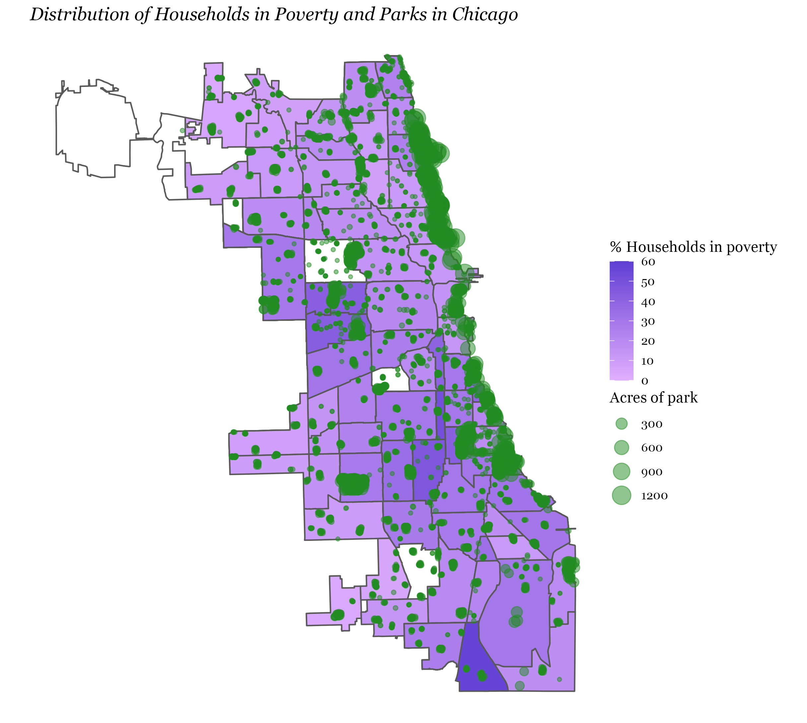
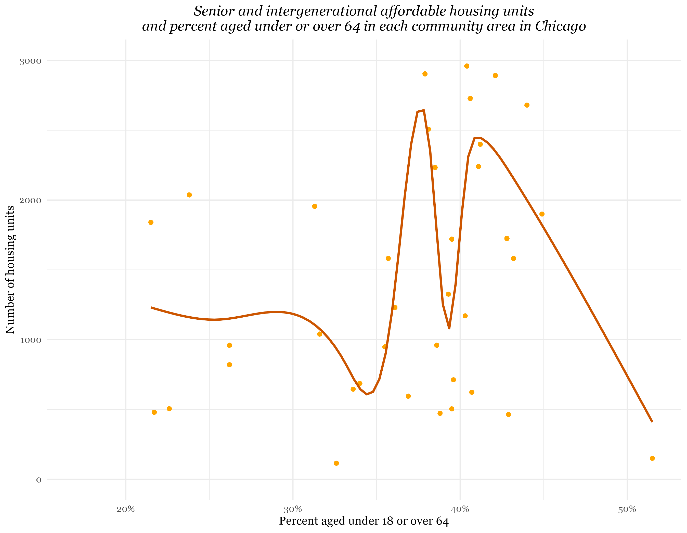
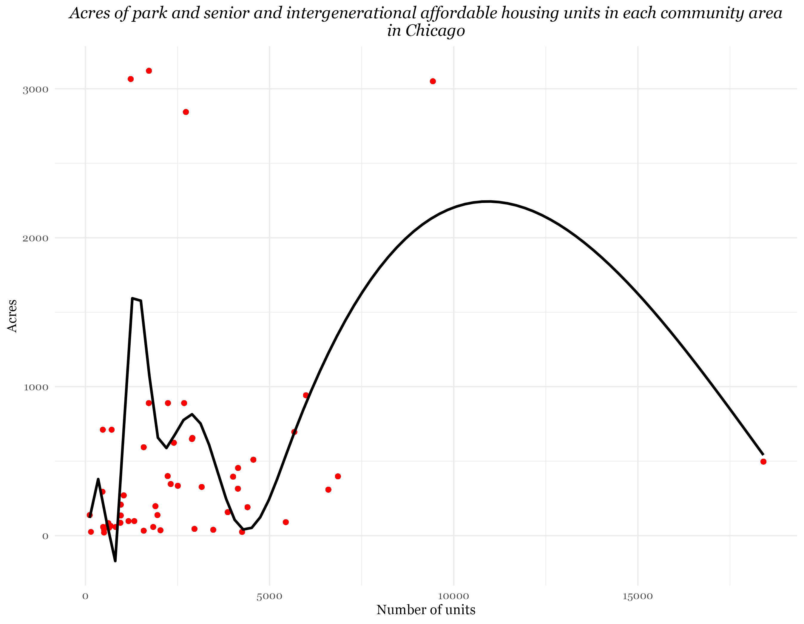
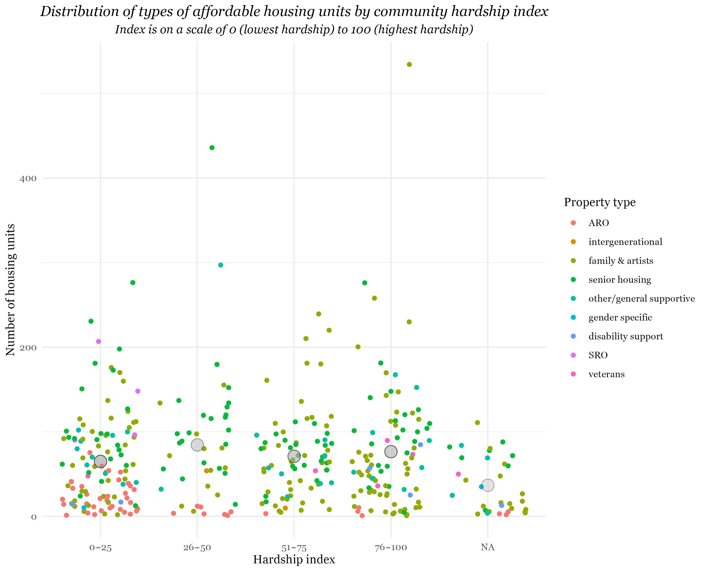

# Final blog (designer): Housing and Spatial Inequality in Chicago

## Introduction
The city of Chicago and other organizations have created affordable housing developments for lower-income individuals to combat housing inequality. With parks often posed as a threat leading to gentrification (Rigolon and Christensen), I seek to explore the question: How do housing units and parks relate to the social and economic inequality in Chicago?

### Data
The data used come from the Chicago Data Portal. These include [Census Data - Selected socioeconomic indicators in Chicago, 2008 – 2012](https://data.cityofchicago.org/Health-Human-Services/Census-Data-Selected-socioeconomic-indicators-in-C/kn9c-c2s2), [Parks - Chicago Park District Park Boundaries (current)](https://data.cityofchicago.org/Parks-Recreation/Parks-Chicago-Park-District-Park-Boundaries-curren/ej32-qgdr), and [Parks - Chicago Park District Facilities (current)](https://data.cityofchicago.org/Parks-Recreation/Parks-Chicago-Park-District-Facilities-current-/5yyk-qt9y).

## Visualizations
### Plot 1-1

It appears that number of units does not impact the number of parks in an area. Most housing units seem to be in the center and the north side of the city.

### Plot 1-2

There seem to be parks distributed well throughout each area. However, there are a areas where the percentage of household poverty is the highest and there are not too many parks present as compared to other areas. There seem to be affordable housing units in the areas with a higher percentage of household poverty in the center of the city but not in the areas farther south.

### Plot 2-1

ARO is the government-provided affordable housing and it is clear that it does not make up the majority of affordable housing units in Chicago. The types of property units seem to be somewhat evenly distributed across each part of the city.

### Plot 2-2

### Plot 3

Grand Boulevard, which has the most amount of units as seen in the previous plot, is about midway between the highest and lowest percentage of household poverty just being slightly lower than 30% of households. 

### Plot 4-1

There does not seem to have a relationship between the number of parks and the average income per capita for each neighborhood. 

### Plot 4-2

There doesn’t seem to be a relationship between the number of affordable housing developments and the average income per capita by the community. However, there may be more units located in lower-income per-capita areas. 

### Plot 5-1

The Near North Side has a lower median of units per property but more properties while Riverdale has a higher median of units but fewer properties. 

### Plot 5-2

Near North Side appears to have more parks with fewer acreage while Riverdale has fewer parks with slightly more acreage.

### Plot 6-1

This next plot focuses on senior and intergenerational affordable housing and displays a very slight relationship between the number of units and percent of under 18 and over 65 people per neighborhood. 

### Plot 6-2

There is a slight positive relationship between the number of units for senior and intergenerational affordable housing and the number of acres of park space. 

### Plot 6-3

However, there does not seem to be a relationship between the number of park acres and the percentage of people under 18 and over 65. 

### Plot 7-1

This plot displays a slight positive relationship between the number of housing units per property/the number of properties and the percentage of crowded housing. 

### Plot 7-2

However, there does not appear to be a relationship between the acreage per park/number of parks and the percentage of crowded housing. 

### Plot 8

It appears that most housing units tend to be in areas with less than about 4000 acres of park. 

### Plot 9-1

The distribution of units is similar for all levels of the hardship index, with the lowest index having the most properties but with fewer units. However, most ARO units tend to be in areas with lower levels on the hardship index. 

### Plot 9-2
 

The distribution of park acreage throughout all the levels of the hardship index tends to be similar.

## Conclusion
There does not appear to be that strong of a relationship of the locations of affordable housing and parks with social and economic inequality in the city from the variables I explored. More affordable housing units seem to tend to be in areas with more overcrowding, there are less affordable units and parks in areas farther South in Chicago, and the type of housing differs in neighborhoods with different indexes of hardship.

### Citations
Rigolon, Alessandro and Jon Christensen. 2019. "Greening Without Gentrification". National Recreation and Park Association. 
[https://www.nrpa.org/parks-recreation-magazine/2019/december/greening-without-gentrification/](https://www.nrpa.org/parks-recreation-magazine/2019/december/greening-without-gentrification/)

Map shape file from [Intro to Making maps with ggplot2](https://thisisdaryn.netlify.app/post/intro-to-making-maps-with-ggplot2/)

