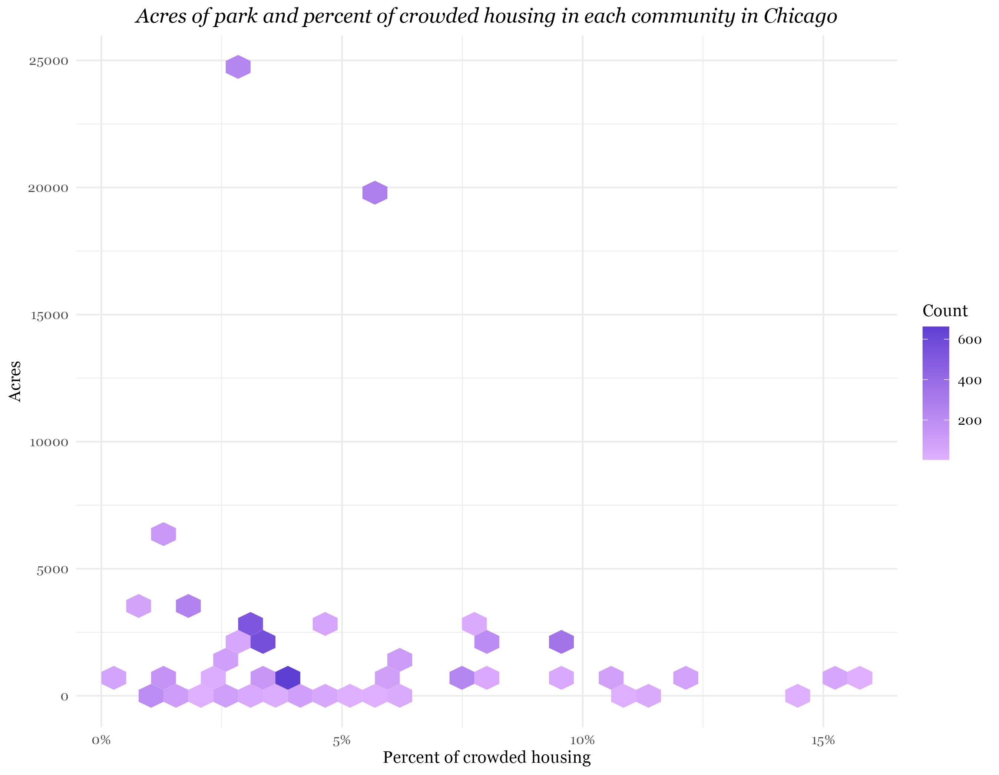

## Final blog: Housing and Spatial Inequality in Chicago

### Introduction
Chicago is a diverse yet segregated city. Not only has this segregation had an impact on the economic wellbeing of each community, but has left an impact of the housing and spacial environment of the city. In an effort to provide support and opportunity for lower income individuals, the city of Chicago and other organizations have commissioned affordable housing developments for qualifying individuals. With parks often posed as a threat of gentrification and green spaces seen as more desireable (Rigolon and Christensen), I think it would be interesting to explore how parks and affordable housing units relate to the city's community by asking the question: How do housing units and parks relate to the social and economic inequality in Chicago?

### Plot 1

This first plot displays the distri 

 
