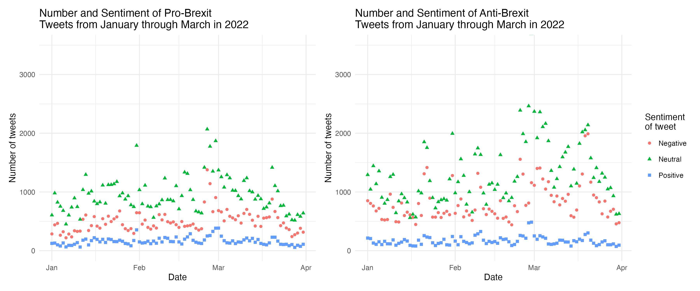
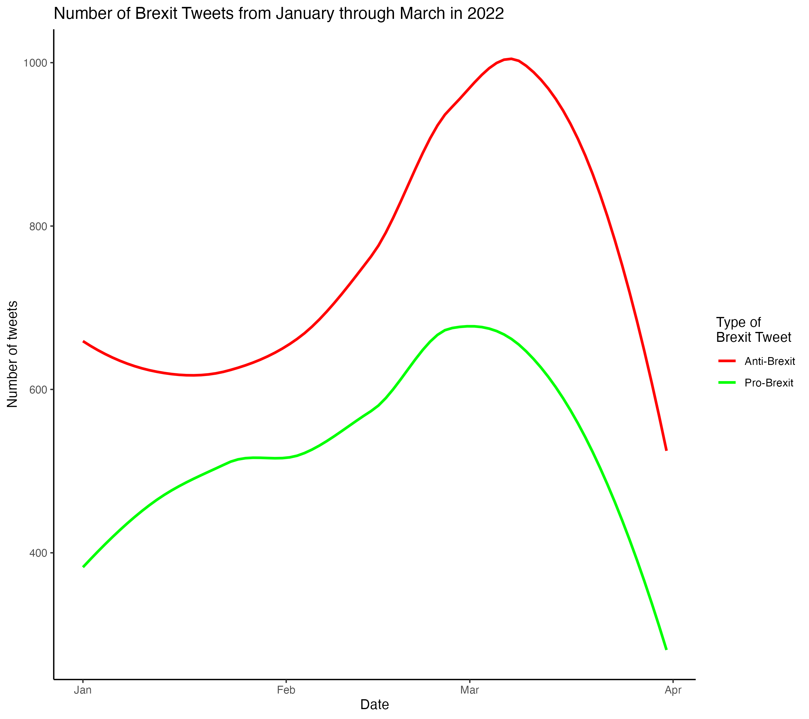
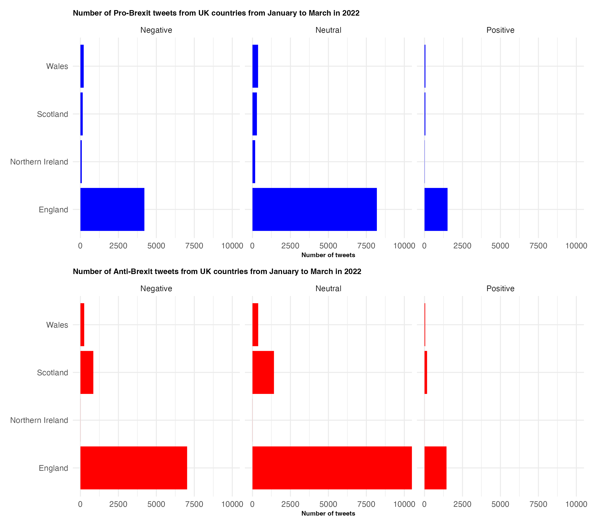

# Short Form Blog 1: Motivating a Point

In 2016, the United Kingdom voted to leave the European Union in an event referred to as “Brexit”. This emphasized the political divide in the United Kingdom with some people in favor and others not. In this divide, there were geographical differences in voting with Scotland and Northern Ireland tending to vote to “remain” and England voting to “leave” (BBC 2021). The transition of the UK leaving the EU occurred from 2020 to 2021 prompting both angered and joyful reactions (CBS 2016). Currently, the UK faces an economic and political crisis with the economy constantly shrinking and political leaders such as the Prime Minister stepping down (Reid and Ward-Glenton 2022). Since the economic collapse can be traced back at least partially to Brexit (Posen 2022), there has been further discussion of Brexit often over social media with some people defending it and others criticizing it. More often than other social media platforms, Twitter is used to discuss and debate hot political topics which include Brexit. This leads to the question, who is tweeting about Brexit, and what is the impact of these tweets currently in the year 2022? Exploring this question could bring insights into the political dynamic in the UK and the power of social media as an outlet for ideological speech.

In order to look into this question, I have chosen the datasets “Brexit-related tweets from pro and anti-Brexit accounts January - March 2022 (Brexit leaning based on their Twitter bios)”. This data is from Harvard Dataverse and was created through a Boolean search by collecting tweets by Twitter accounts publicly stating positions on Brexit. This data was originally used for a Master’s degree dissertation. It appears to be trustworthy based on these credentials, and it additionally chooses to state exactly what the data set is measuring which illuminates its possible limitations. These include the fact that it only collects data from Twitter accounts with a Brexit-related bio and most likely does not capture all of these accounts. It also only collects data for 3 months and is missing values for certain important variables in the data set. There are also variables that could be considered subjective like “sentiment” and “reach” which the researcher chooses to define as their interpretation of the tweet’s tone and the number of followers for each tweet. This could potentially be misleading so it is important to acknowledge these shortcomings in the data.

This first plot I created displays two bar plots for each Brexit ideology with the number of tweets recorded on the y-axis and the month in 2022 on the x-axis. The bars are also stacked in order to show the proportion of each tweet’s sentiment which I understand as “negative” being pessimistic, “positive” being optimistic, and “neutral” being neither. This plot can compare the change in the number of tweets and their sentiment per ideology according to month. As seen in the plot, there appear to be more anti-Brexit tweets than pro-Brexit tweets and the number of anti-Brexit tweets per month increases over time while the pro-Brexit tweets appear to stay about the same in each month recorded. The sentiment for both plots seems to remain proportionally the same. This can help show how each ideology changes its Twitter expression habits over time which brings insight into who is making most of the tweets and how time is impacting the amount of speech on this subject. From this graphic, it may be assumed that anti-Brexit ideologies and a neutral or negative sentiment are more prevalent on Twitter, and the amount of anti-Brexit tweets is growing with time.  Some limitations of this plot are that the two bar graphs are not side-by-side so it may make it difficult to compare. The sentiment aspect may also be confusing as to what it means and the number of tweets may also be misleading since this data does not include every tweet about Brexit that exists. In addition, some of the months don’t include every day, so the data displayed may be inaccurate for comparison purposes. 

In order to rectify some of the previous plot's shortcomings, I created side-by-side scatter plots which are plotted over time as a continuous variable. I also took out “Not Rated” sentiment tweets in order to observe how the sentiments change over time. This plot can more clearly show the increase in negative and neutral sentiment anti-Brexit tweets and the constancy of the positive sentiment anti-Brexit tweets. The pro-Brexit tweets can be seen to slightly increase then decrease as time passes with the sentiments remaining proportionally the same. This seems to tell us a similar story to the previous plot. This plot also reveals the days in which most Brexit tweets are occurring. Understanding how these tweets change over time can help understand the present state of attitudes towards Brexit as well as understanding the political context. The limitations of this plot are also similar to that of the last plot, but this plot poses an additional problem in that it may be difficult to read because there are so many points and only a slight variation. It may be more honest, but that makes it more difficult to understand.

I included an additional plot to the last two in order to clearly display and compare the correlation between time and the number of tweets for each ideology. In this, it appears that both tend to increase and then decrease in a similar pattern. This might suggest that as time goes by the discussion of the topic in both ideologies increased over time, ignoring the end of the plot. One problem with this plot is that it goes to April when the data actually stops near the end of March. This means that the calculation for the correlation line is inaccurate. In addition, the lack of a grid makes it difficult to see the specifics, but I chose not to use a grid because it is not that accurate and only is meant to show general patterns. A smooth plot might also have not been the best decision for this data since the points are so scattered, but it makes it easy to understand.

This next plot compares the number of tweets from each UK country faceted by sentiment for each ideology. This shows some of the same trends we’ve seen before with the anti-Brexit tweets and a negative and neutral sentiment being more prevalent, but it also brings light to which countries in the UK the majority of the tweets are coming from. Most of the tweets appear to be coming from England which is understandable since England is the most populated. There is also a significant amount of anti-Brexit tweets coming from Scotland and the only recorded tweets from Northern Ireland are pro-Brexit which gives us insight into who is tweeting such ideologies. The sentiments don’t appear to change proportionally by location or ideology which seems to show that the sentiment is just usually negative or neutral. A limit of this graph is that it shows the number of tweets rather than the proportion, so it is difficult to compare the differences in which geographical region tweets which ideology. Also, the bars not being side-by-side with their corresponding region adds to this difficulty. 

Since we’ve looked at where the tweets are coming from, I created this plot in order to see the impact of the tweets and which tweets have more reach. It boxplots to show the distribution of reach of each tweet in followers for each country and ideology for the month of January and with a negative sentiment. The interesting part of this plot is that the highest median reach is for pro-Brexit tweets in Scotland which, as seen in earlier plots, does not tend to produce the most tweets. This could be explained by the low amount of tweets since England might have many tweets that have low reach and many that have high. Looking at the boxplots for England, the median reach for anti-Brexit tweets is higher than that for pro-Brexit. This could mean the impact of anti-Brexit tweets from England is greater because the amount of anti-Brexit tweets from England is also greater than that of pro-Brexit tweets from England as seen earlier. However, a shortcoming of this plot is that it doesn’t show the number of tweets along with their reach which would give the full picture if gathered. Some of the outliers had to be framed out of the plot in order to see the boxplots so some of the data is not displayed. I also was unable to include all the data because of the size of the data sets , so I focused on January and negative sentiment because those seemed to make up the highest proportion of the tweets. 

Although these plots help answer the posed question partially, I would gather more data on the number of tweets and locations and specify the sentiments so that they are easier to understand. I would also combine the data sets completely so they have been plotted together and calculate the proportions of reach to the number of tweets. I would also collect data on the demographics of the United Kingdom so that the population difference can be understood proportionally. With some more work, these plots could more accurately help answer the question of who these tweets are coming from and their impact on social media. 

### Citations
BBC, 2021, “EU referendum: The result in maps and charts”
 
CBS, 2016, “Global reactions to Brexit”
 
Lynch, Gareth, 2022, "Twitter datasets: Brexit related tweets from pro and anti Brexit accounts January - March 2022 (Brexit leaning based on their Twitter bios)", https://doi.org/10.7910/DVN/FXEFZT, Harvard Dataverse, V1
 
Posen, Adam S., 2022, “The UK and the global economy after Brexit”, PIIE
 
Reid, Jenni and Hannah Ward-Glenton, 2022, “UK Prime Minister Liz Truss resigns after failed budget and market turmoil”, CNBC

