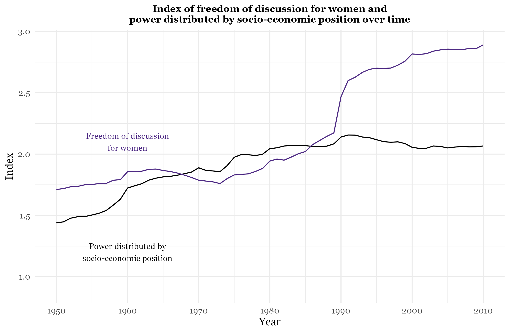
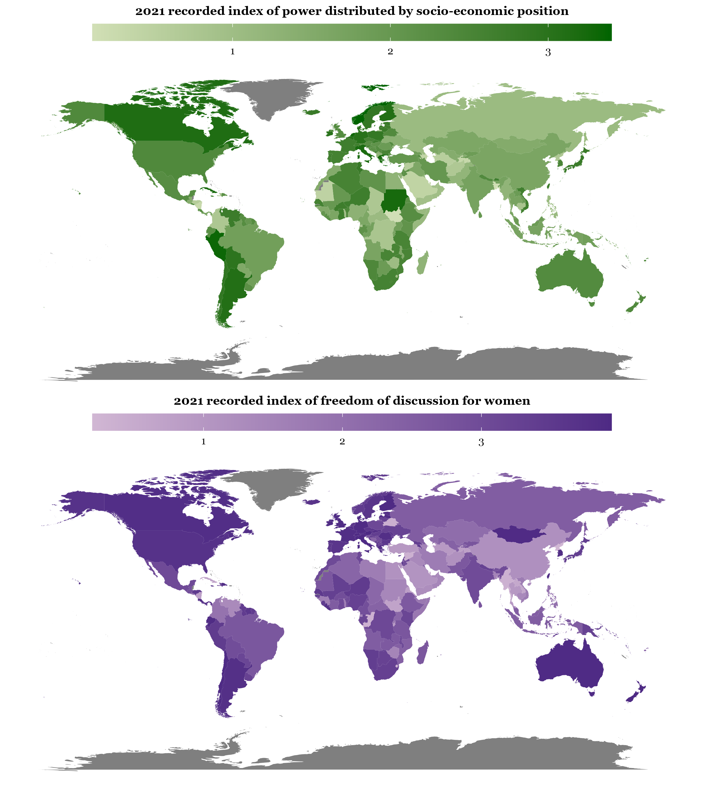
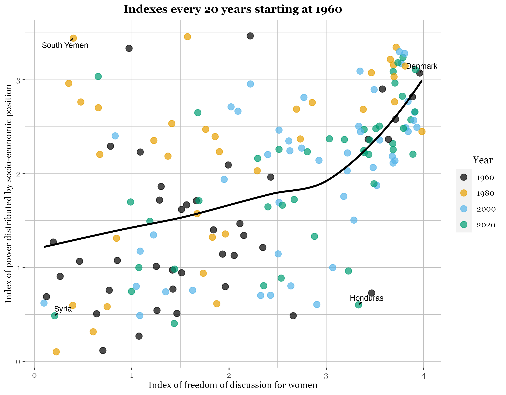
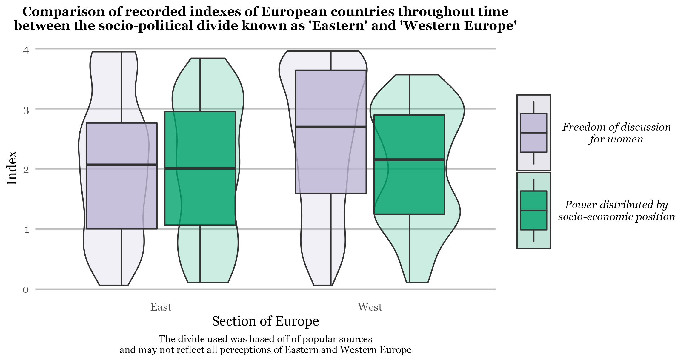

# Short Form Blog 2: Many ways to see it

The variables “power distributed by socio-economic position” and “freedom of discussion for women” are scaled by an index of 0 to 4, 4 meaning most distributed and most freedom respectively.  “Power distributed by socio-economic position” is determined by “attributes of wealth, occupation, or other economic circumstances such as owning property” and the political effects of inequality. “Freedom of discussion for women” is measured by “the extent to which women are able to engage in private discussions, particularly on political issues, in private homes and public spaces (restaurants, public transportation, sports events, work, etc.) without fear of harassment by other members of the polity or the public authorities.” Both of these make sense in determining the index. Still, I’m not sure how these would be measured since they appear to be subjective. I also think that for “freedom of discussion for women”, it should be more specific because there can be different spaces which may be more free for discussion. 
 
 
 
 

In this first plot of indexes over time, it is clear that both variables’ indexes are increasing over time, although “freedom of discussion for women” appears to be increasing at a faster rate. I think time is important to measure these two variables since often we see progress with time. It seems that the progress of each is somewhat related but not completely since there is a difference in their changes. In general, it seems to be if freedom of discussion increase, power distribution also increases.
 
 
 
 

In this next plot, I displayed 2 maps for each variable. I chose to use the year 2021 since it is the most recent data and to display maps of the indexes to see how they vary by country. Overall, indexes vary greatly across countries. There is some overlap between the two plots where the indexes for each variable are the same in the same country, but there were many differences such as the country Mongolia which seems to have a low index for “power distributed by socio-economic position” but high for “freedom of discussion for women”. Some countries follow a similar pattern of the variables indexes being the same, but other countries display the opposite suggesting that progress in these variables isn’t necessarily the same based on differing contexts. 
 
 
 
 

This scatterplot displays the somewhat loose positive relationship between the two variables. I chose to group by year for every 20 years to see if year follows the pattern of this relationship. Based on the first plot, I expected the colors to be clustered together since they represent the years in which the index was taken. However, there is a lot of mixing. I labeled a few points that I thought were complete outliers to the pattern of a higher index with time and a relationship between the two variables being compared.
 
 
 
 

In this last plot, I decided to compare “Eastern” and “Western” countries in Europe and the variables for each since this is an interesting sociopolitical divide between closely positioned countries. In the East, the two variables’ indexes appear to be about the same. In the West, both of the variables have a higher index than in the East, and the index for “freedom of discussion for women” is skewed higher than that of “power distributed by socio-economic position”. 
 
 
 
 

### Bibliography
ile., See AUTHORS. 2022. Paletteer: Comprehensive Collection of Color Palettes. [https://github.com/EmilHvitfeldt/paletteer](https://github.com/EmilHvitfeldt/paletteer).

Pedersen, Thomas Lin. 2022. Patchwork: The Composer of Plots. [https://CRAN.R-project.org/package=patchwork](https://CRAN.R-project.org/package=patchwork).
Slowikowski, Kamil. 2021. Ggrepel: Automatically Position Non-Overlapping Text Labels with Ggplot2. [https://github.com/slowkow/ggrepel](https://github.com/slowkow/ggrepel).

Wickham, Hadley. 2022. Tidyverse: Easily Install and Load the Tidyverse. [https://CRAN.R-project.org/package=tidyverse](https://CRAN.R-project.org/package=tidyverse).

Coppedge, Michael, John Gerring, Carl Henrik Knutsen, Staffan I. Lindberg, Jan Teorell,
Nazifa Alizada, David Altman, Michael Bernhard, Agnes Cornell, M. Steven Fish, Lisa
Gastaldi, Haakon Gjerløw, Adam Glynn, Allen Hicken, Garry Hindle, Nina Ilchenko, Joshua
Krusell, Anna Lührmann, Seraphine F. Maerz, Kyle L. Marquardt, Kelly McMann, Valeriya
Mechkova, Juraj Medzihorsky, Pamela Paxton, Daniel Pemstein, Josefine Pernes, Johannes
von Römer, Brigitte Seim, Rachel Sigman, Svend-Erik Skaaning, Jeffrey Staton, Aksel
Sundström, Eitan Tzelgov, Yi-ting Wang, Tore Wig, Steven Wilson and Daniel Ziblatt. 2021.
"V-Dem [Country–Year/Country–Date] Dataset v11.1" Varieties of Democracy (V-Dem)
Project. https://doi.org/10.23696/vdemds21.

Pemstein, Daniel, Kyle L. Marquardt, Eitan Tzelgov, Yi-ting Wang, Juraj Medzihorsky,
Joshua Krusell, Farhad Miri, and Johannes von Römer. 2021. “The V-Dem Measurement
Model: Latent Variable Analysis for Cross-National and Cross-Temporal Expert-Coded
Data”. V-Dem Working Paper No. 21. 6th edition. University of Gothenburg: Varieties of
Democracy Institute.

Coppedge, Michael, John Gerring, Carl Henrik Knutsen, Staffan I. Lindberg, Jan Teorell,
David Altman, Michael Bernhard, Agnes Cornell, M. Steven Fish, Lisa Gastaldi, Haakon
Gjerløw, Adam Glynn, Allen Hicken, Anna Lührmann, Seraphine F. Maerz, Kyle L.
Marquardt, Kelly McMann, Valeriya Mechkova, Pamela Paxton, Daniel Pemstein, Johannes
von Römer, Brigitte Seim, Rachel Sigman, Svend-Erik Skaaning, Jeffrey Staton, Aksel
Sundtröm, Eitan Tzelgov, Luca Uberti, Yi-ting Wang, Tore Wig, and Daniel Ziblatt. 2021.
"V-Dem Codebook v11.1" Varieties of Democracy (V-Dem) Project.

[https://www.nationsonline.org/oneworld/map/central-europe-map.htm](https://www.nationsonline.org/oneworld/map/central-europe-map.htm)

