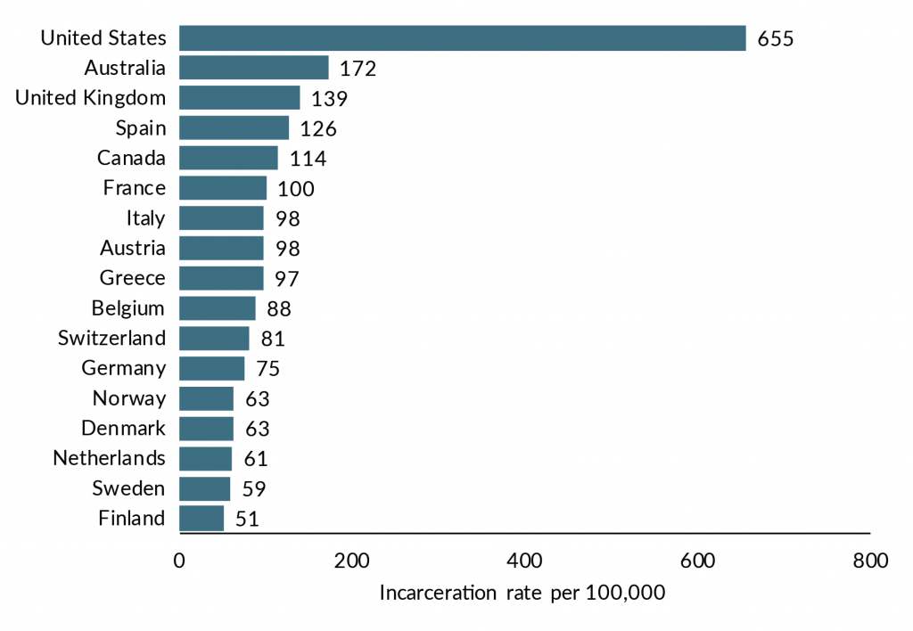

## Visualization Blog 1: Just the Basics
### Theme: CONTROVERSY!!! CONTENTION!!!

**#1) A Visualization I Really Like:**

**I really like this visualization because it is simple and to the point. It is clear in what it wants to represent and the way it chooses to do so. I like how it labels the x axis clearly "Incarceration rate per 100,000". Although it doesn't specify the y-axis and what 100,000 is, it is clear what it means due to the context of the article 
