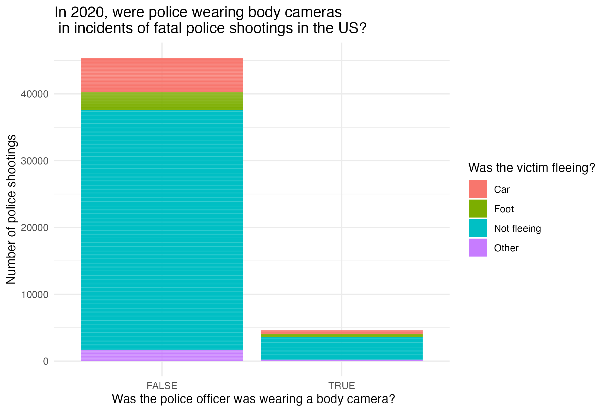

# Visualization Blog 1: Just the Basics + Controversy
## Theme: CONTROVERSY!!! CONTENTION!!!

### #1) A Visualization I Really Like:

I really like this visualization because it is simple and to the point. It is clear in what it wants to represent and the way it chooses to do so. I like how it labels everything clearly and representatively. It has a title that states what the visualization is being used to argue and specifies how this is being measured so that it is as clear as possible: "Incarceration rate per 100,000 people of any age". The value that each country's fills represents is labeled obviously above the map to prevent misinterpretation. The map format makes it easy to view and compare each country and using a rate rather than a total value makes it comparable without being misleading. I like how there are a few but not too many countries across the world pointed out along with the US to make it less of an overwhelming data set since there are so many countries on the map. I also like how there is a note detailing aspects of this image that are not so clear on the map and that the research center that created this visualization is also noted at the bottom.

ggplot(scale = 'medium', type = 'map_units', returnclass = "sf") +
    geom_sf(aes(fill = inc_rate) +
    labs(
    title = "U.S. a larger share of its population than any other country",
    subtitle = "Incarceration rate per 100,000 people of any age"
    )

### #2) A Visualization I Really Dislike:

My problem with this graph is that it has the appearance of being sophisticated because of all the details, labels, and descriptions but I don't believe the format was a good choice for the data it is presenting. It has all the details of a good visualization, but the decision to use a pie chart to show "how many people are locked up in the US" was an error which makes this a visualization I really dislike. The visualization gives the the numbers of people locked up within the pie chart, but this does not demonstrate the magnitude of incarcerated people in the US as the title would suggest. It puts the numbers out of a whole of incarcerated people and divides it by where they are imprisoned and why. I believe this data should be in comparison with the entire US population which would more clearly and representatively demonstrate "how many people are locked up in the US". Therefore, I believe this chart is misleading in its format.

### #3) Creating my own visualization:

The data used in this visualization was collected by the Washington Post

This visualization displays a bar graph of police shootings recorded by the Washington Post in the year 2020. There has been frequent discussion of police brutality and holding police accountable. This brings up the discussion of police wearing body cameras. The graph shows the number of people who were victims of these fatal shootings, whether or not the police officer who committed the shooting was wearing a body camera, and if/how the victim was fleeing when they were shot. From this graph, we can see that most police officers were not wearing body cameras during the incidents reported in 2020. It appears that most victims were not fleeing in these shootings with both police wearing cameras and not wearing cameras, but there were a significant number of people who were fleeing as seen in the "FALSE" column of the graph. All parts of this data should be looked at since they represent the experiences of people.
