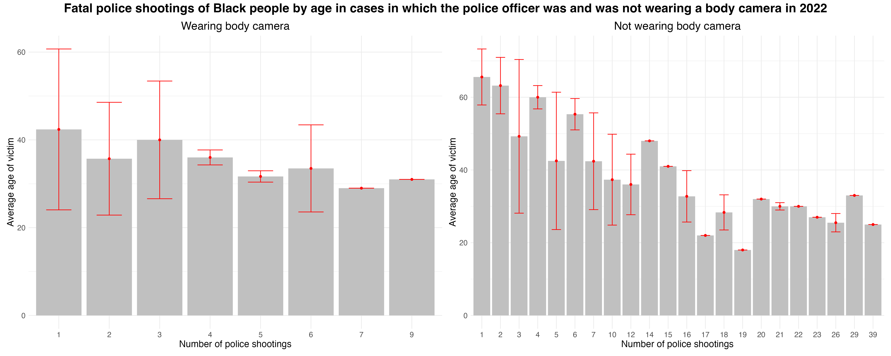

# Visualization Blog 2: Adding Uncertainty

## Plotting Uncertainty

### Plot 1

I chose to use geom_ribbon to visualize uncertainty because the line is continuous, and I wanted something to wrap around the lines. I tried using two line to represent the uncertainty, but it looked cluttered and didn't visualixe the range of values that the correct number could be. I made it transparent because the ribbons overlap, and I wanted to make sure you can see all of them.

### Plot 2

I created a new plot based off of my old bar plot because it was made up primarily qualitative vales, and I didn't understand how to make an error bar for any other form that would work with that section of the data besides a bar plot. I used an error bar to display the error because it made the most sense to use on a bar plot. I made the bar red to distinguish it from the bars and made the ends narrower so they would not ooverwhelm the plot. I also made the image wider so that it didn't look so cluttered. 

