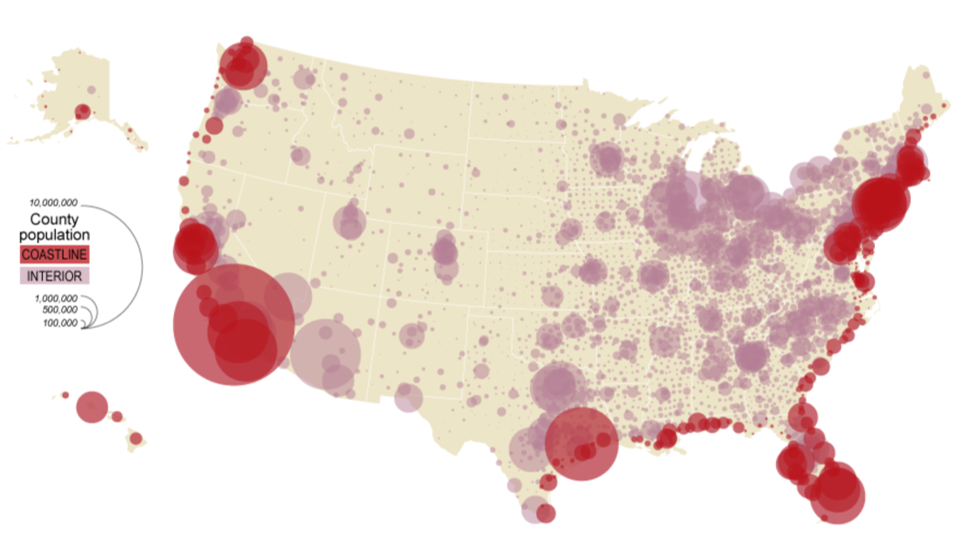
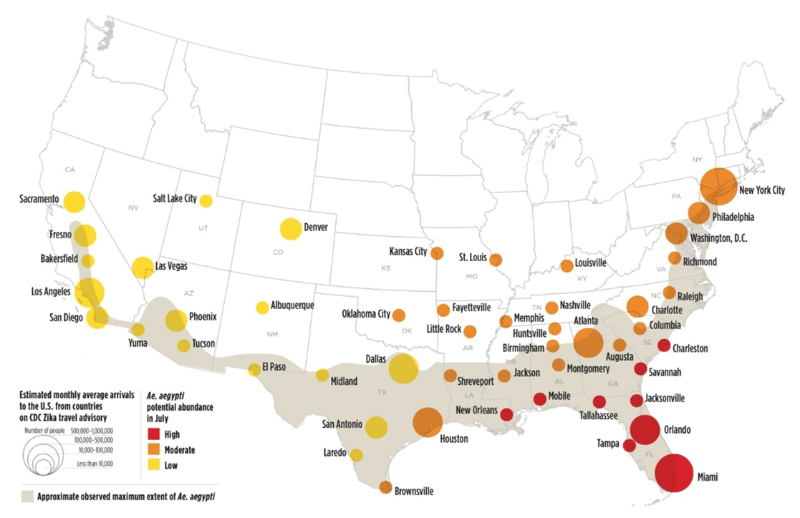
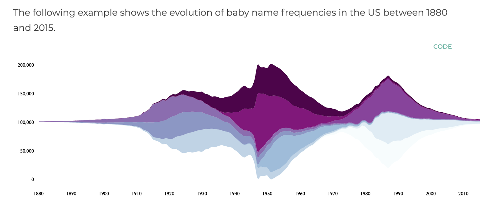

# Visualization Blog 3: Final project proposal

### Question
**How are affordable housing unit developments and green space distributed and utilized in different communities in Chicago? And what are the implications of economic and social inequality in the current housing crisis?**   

### Potential data sources
- [Affordable Rental Housing Developments](https://data.cityofchicago.org/Community-Economic-Development/Affordable-Rental-Housing-Developments-Map/k3g7-7kgc)
- [Chicago Census Data](https://data.cityofchicago.org/Health-Human-Services/Census-Data-Selected-socioeconomic-indicators-in-C/kn9c-c2s2)
- [Location Affordability Index](https://hudgis-hud.opendata.arcgis.com/datasets/location-affordability-index-v-3/explore?location=12.129159%2C0.315617%2C1.93)
- [Chicago Park Boundaries](https://data.cityofchicago.org/Parks-Recreation/Parks-Chicago-Park-District-Park-Boundaries-curren/ej32-qgdr)

These data sets could be useful for answering my questions because it will give me an understanding of the layout of new housing projects and parks in Chicago as when as general demographic and economic details. It will allow me to explore the economic and social relationship of the number and types of housing developments and parks in each neighborhood or area.

